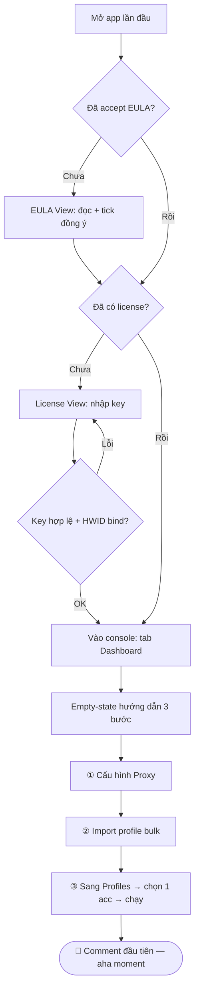
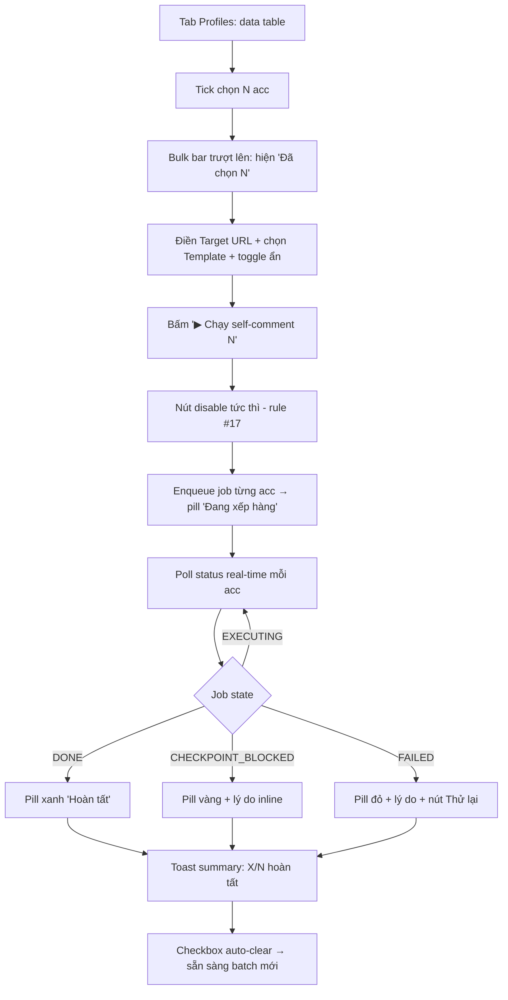
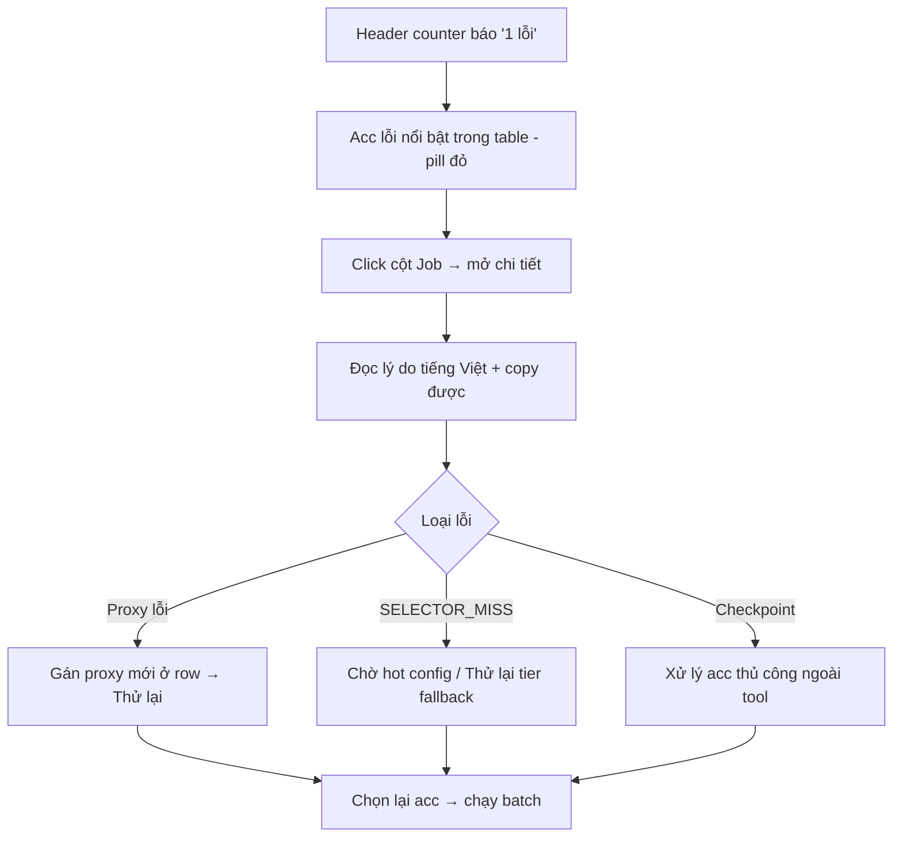

# UX Design Specification — automation-desktop

**Author:** Luisphan
**Date:** 2026-06-04
**Phạm vi:** Tái cấu trúc Information Architecture + visual redesign cho desktop tool vận hành multi-account Facebook self-comment (Phase 3.0).

---

## Executive Summary

### Project Vision

automation-desktop là **operator console** giúp một người vận hành tự tin điều khiển hàng chục tài khoản Facebook cùng lúc — import, gán proxy, chạy self-comment hàng loạt — với trạng thái real-time rõ ràng và độ tin cậy cao. UX phục vụ triết lý "adapt time": người dùng luôn thấy rõ điều gì đang xảy ra và kiểm soát được nó.

### Target Users

**Primary — "Minh", operator solo** (affiliate marketer / content creator): ~10–15+ tài khoản FB nuôi sẵn (cookie + 2FA), không phải developer nhưng thao tác nhanh và lặp lại, dùng desktop màn hình rộng nhiều giờ. Migrate từ tool C# WinForms crash-prone. Cần: tốc độ hàng loạt, trạng thái rõ, copy được dữ liệu (UID/proxy/job id), không sợ mất job khi crash.

### Key Design Challenges

1. **Mật độ thông tin cao trên desktop** — nhiều acc × nhiều thuộc tính cùng lúc (layout card `min(780px)` căn giữa hiện tại chống lại điều này).
2. **Bulk action là mặc định, không phải ngoại lệ** — multi-select cho chạy / gán proxy là yêu cầu cốt lõi (metric: ≥10 profile song song; time-to-first-action < 15 phút).
3. **Trạng thái real-time đa cấp** — profile status (idle/running/checkpoint/error) + 10 job state (PENDING→DONE) phải scan được, không đọc text dài.
4. **Ràng buộc cứng**: lock tiếng Việt (NFR28, Phase 3.0→3.9), giữ `data-testid` cho E2E, plain CSS (KHÔNG Tailwind dù context ghi vậy), tuân 25 rule trong `automation-desktop/CLAUDE.md` (đặc biệt rule #16 loading-shell, #17 disable-on-click).
5. **IA mở rộng được** cho Phase 3.1–3.3 (mass post/comment/share), backup/recovery, telemetry settings, notification phục hồi selector.

### Design Opportunities

1. **Operator console full-width + navigation** (Dashboard / Profiles / Templates / Proxy / Settings) thay cho card cuộn dọc 780px — biến tool thành nơi vận hành chuyên nghiệp ngang AdsPower / MultiLogin.
2. **Bulk action bar** — chọn nhiều acc → 1 thao tác, đánh trúng nỗi đau "click từng cái" của tool nguồn.
3. **Ngôn ngữ "control room"** — dark functional gọn dày, hệ màu status nhất quán, đọc trạng thái hàng chục acc trong 1 liếc mắt; bỏ glow marketing (gradient cam-xanh, Georgia serif 64px) + bật lại copy text (gỡ `user-select: none`).

## Core User Experience

### Defining Experience

Vòng lặp giá trị: **Chọn → Chạy hàng loạt → Theo dõi real-time**. Operator nhìn bảng tài khoản, multi-select, kích hoạt self-comment một lần cho nhiều acc, và quan sát chúng chuyển trạng thái đến DONE. Import / gán proxy / template là bước chuẩn bị phục vụ vòng lặp này.

### Platform Strategy

Desktop Electron (Win10+/macOS12+), chuột + bàn phím, màn hình rộng ≥1280px, min 8GB RAM. Tận dụng: multi-select (checkbox + Shift/Ctrl-click), keyboard shortcut, copy text, hover tooltip, context menu. Offline-aware: phản ánh license grace 24h + job resume sau crash. KHÔNG dùng layout mobile/touch hay card hẹp 780px.

### Effortless Interactions

1. Chạy nhiều acc cùng lúc (tick chọn → 1 nút) — differentiator chính vs tool C# nguồn.
2. Copy được mọi dữ liệu vận hành (UID, proxy host:port, job id, error) — gỡ `user-select: none`.
3. Đọc trạng thái hàng chục acc trong 1 liếc — badge màu nhất quán, không text dài.
4. Target URL + chọn template gắn trực tiếp với hành động chạy — không quên, không random ngầm.

### Critical Success Moments

- **Make:** Lần đầu chọn nhiều acc → 1 nút chạy → badge chuyển `Đang chạy`→`Hoàn tất`, comment thật xuất hiện (aha moment per PRD J1).
- **Break:** Job lỗi mà operator không hiểu lý do hoặc không tìm thấy acc lỗi trong list dài → error message phải rõ + acc lỗi nổi bật + copy được.
- **First-time:** Mở app → comment đầu tiên < 15 phút qua onboarding 3 bước: cấu hình proxy → import acc → chạy.

### Experience Principles

1. **Hàng loạt là mặc định** — mọi hành động chính hỗ trợ multi-select; thao tác đơn lẻ là trường hợp con của hàng loạt.
2. **Trạng thái nhìn-là-hiểu** — màu + icon + badge thay cho text dài; real-time, không cần refresh.
3. **Dữ liệu thuộc về operator** — luôn copy được, luôn export được; tool không giam dữ liệu.
4. **Mật độ phục vụ tốc độ** — desktop dày thông tin, ít cuộn, ít click; tôn trọng người làm việc lặp lại hàng giờ.
5. **Tin cậy hơn hoa mỹ** — visual functional, không glow marketing; mỗi pixel phục vụ việc vận hành.

## Desired Emotional Response

### Primary Emotional Goals

Cảm xúc cốt lõi: **"Tôi đang nắm quyền điều khiển" (in control)** — lật ngược lo âu từ tool C# crash-prone thành sự điềm tĩnh của một người chỉ huy nhìn xuống phòng điều khiển: mọi acc trong tầm mắt, mọi hành động trong tầm tay.

### Emotional Journey Mapping

- **Mở app lần đầu** → an tâm, được dẫn dắt (tránh: choáng ngợp).
- **Import + setup** → gọn gàng, máy hiểu định dạng (tránh: bực vì lỗi format mù mờ).
- **Bấm chạy hàng loạt** → quyền lực, phấn khích nhẹ (tránh: mệt vì click lặp).
- **Theo dõi job** → tin cậy, minh bạch (tránh: hồi hộp mù mờ).
- **Job lỗi/checkpoint** → bình tĩnh kiểm soát (tránh: hoảng, đổ lỗi tool).
- **Quay lại hôm sau** → quen thuộc, đáng tin (tránh: nghi ngờ crash).

### Micro-Emotions

- **Trust > Skepticism** — operator giao cookie/2FA (tài sản quý); thiết kế phải toát "dữ liệu an toàn & thuộc về bạn".
- **Confidence > Anxiety** — trạng thái real-time + error rõ = giảm lo âu (khác biệt cảm xúc chính vs tool C#).
- **Accomplishment > Frustration** — bulk run + "12/15 Hoàn tất" = hoàn thành; click 15 lần = frustration.

### Design Implications

- **In control** → bảng tổng quan full-width, counter "X đang chạy / Y lỗi", nút dừng/hủy luôn hiển thị.
- **Trust** → copy được dữ liệu, nhãn "lưu trong OS keychain", confirm rõ khi xóa cookie vĩnh viễn.
- **Confidence** → badge màu nhất quán + tooltip giải thích state, error kèm gợi ý hành động.
- **Calm-on-error** → checkpoint/lỗi dùng vàng/đỏ tiết chế (không báo động toàn màn hình), mỗi lỗi có lý do tiếng Việt + cách xử lý.

### Emotional Design Principles

1. **Minh bạch tạo tin cậy** — không bao giờ giấu trạng thái; operator luôn biết chuyện gì đang xảy ra.
2. **Lỗi không phải thảm họa** — báo lỗi điềm tĩnh, hành động hóa, không gây hoảng.
3. **Hoàn thành phải cảm nhận được** — phản hồi rõ khi job xong, summary "X/Y thành công".
4. **Quyền lực qua quy mô** — cảm giác "điều cả đội" khi chạy hàng loạt, không phải lao động tay chân lặp lại.

## UX Pattern Analysis & Inspiration

### Inspiring Products Analysis

**Đối thủ trực tiếp (PRD): AdsPower, GoLogin, MultiLogin, Dolphin{anty}** — operator đã quen mental model multi-profile của chúng: bảng profile + checkbox, bulk toolbar, cột status/proxy/group, sidebar điều hướng. **Control room hiện đại (Linear, Vercel dashboard):** dark functional, status pill nhất quán, empty state có hướng dẫn, feedback điềm tĩnh. **Trust-first tools (Raycast, 1Password):** ngôn ngữ rõ về mã hóa/keychain, thao tác nhanh ít ma sát.

### Transferable UX Patterns

- **Navigation:** Sidebar trái cố định (Dashboard · Profiles · Templates · Proxy · Settings) — thay card cuộn dọc.
- **Interaction:** Checkbox + bulk action bar nổi lên khi chọn; status pill + tooltip thay text dài; toast/inline confirm điềm tĩnh.
- **Visual:** Dark functional, table dày thông tin, status pill màu nhất quán, typography sans gọn (bỏ Georgia serif 64px).

### Anti-Patterns to Avoid

1. Card 780px căn giữa (landing-page feel).
2. Action lặp từng dòng, không bulk.
3. `user-select: none` chặn copy.
4. Glow/gradient marketing nặng gây nhiễu đọc trạng thái.
5. Quá tải cột (over-engineer như AdsPower full) — Phase 3.0 chỉ cần cột cốt lõi.
6. Báo lỗi toàn màn hình đỏ gây hoảng.

### Design Inspiration Strategy

**Adopt:** sidebar nav, profile table + checkbox, bulk action bar, status pill + tooltip, dark functional palette.
**Adapt:** đơn giản hóa số cột so với AdsPower cho phù hợp Phase 3.0 (UID · Tên · Status · Proxy · Job); empty-state onboarding 3 bước; giữ dark theme nhưng tiết chế (bỏ gradient glow, giữ 1 accent màu).
**Avoid:** layout card hẹp, per-row-only action, user-select:none, lỗi toàn màn hình, over-engineer cột/feature ngoài scope 3.0.

## Design System Foundation

### Design System Choice

**Custom lightweight design system — "Operator UI Kit"**, xây trên nền plain CSS hiện có (KHÔNG thêm Tailwind/MUI/Ant). Nâng cấp bằng cách trích **design tokens** (CSS custom properties) và bổ sung các component vận hành còn thiếu (sidebar nav, data table, checkbox, bulk action bar, status pill, toast, empty state).

### Rationale for Selection

1. **Không thêm dependency** — phù hợp Electron bundle, sandbox, solo dev; tránh runtime CSS-in-JS.
2. **Bảo toàn `data-testid` + E2E** — refactor CSS/markup tăng dần, không thay framework, ít rủi ro vỡ test (rule #16, #18, #20).
3. **Codebase đã có sẵn 1 custom CSS system** (~676 dòng `main.css`, class naming nhất quán) — chỉ thiếu token hóa + vài component; tái dùng class hiện tại.
4. **Đúng triết lý "tin cậy hơn hoa mỹ"** — kiểm soát từng pixel cho control-room density.
5. **Lock tiếng Việt + i18n defer** — không cần i18n tooling của hệ thống lớn ở Phase 3.0.

> **Migration path tương lai (ghi nhận, KHÔNG làm ở 3.0):** nếu sau này muốn Tailwind v4, token hóa CSS variables ở bước này chính là cầu nối — token map 1:1 sang `@theme`.

### Implementation Approach

- Tạo lớp **design tokens** trong `base.css` (`:root`): color (bg/surface/border/text/accent + status), spacing scale, radius, font scale, shadow.
- Refactor `main.css` để dùng token thay hardcode (đổi gradient glow → surface phẳng, Georgia 64px → sans scale hợp lý).
- Thêm component CSS mới: `.app-shell` (sidebar + content grid), `.data-table` + `.row-checkbox`, `.bulk-bar`, `.status-pill` (chuẩn hóa từ `.status-badge`), `.toast`, `.empty-state`.
- Giữ nguyên mọi `data-testid`; chỉ đổi class/markup wrapper, không đổi test hook.

### Customization Strategy

- **1 accent màu** chủ đạo (quyết tông cụ thể ở bước visual — giữ cam ấm tiết chế hoặc chuyển trung tính hơn).
- **Hệ màu status nhất quán** dùng chung cho profile status + job state + proxy health (hiện đang rời rạc).
- **Dark-first**, để ngỏ light theme tương lai qua token (không làm ở 3.0).
- Component mới tuân rule loading-shell riêng (#16) và disable-on-click (#17).

## Defining Experience & Mechanics

### Defining Experience

**"Tick & run a fleet"** — operator multi-select tài khoản trong data table, cấu hình ngay tại bulk action bar (target URL + template), bấm 1 nút chạy self-comment cho cả batch, và theo dõi từng acc đổi trạng thái real-time đến hoàn tất.

### User Mental Model

Operator nghĩ theo "đội tài khoản" (fleet), không phải từng record — kế thừa từ lưới acc của tool C# và mental model AdsPower (table + checkbox + bulk). Điểm rối hiện tại cần sửa: target URL tách rời nút chạy, không thấy template được dùng, không có summary sau batch.

### Success Criteria

- Chọn N acc → 1 nút → N badge đồng loạt đổi `Đang chạy`.
- Mỗi acc có pill real-time; thanh tổng "X/N hoàn tất".
- Nút phản hồi tức thì (disable + spinner), không đơ.
- Tự động hóa: app tự lấy proxy, random template, retry — operator không lo từng bước.

### Novel vs Established Patterns

**Established:** data table + checkbox + bulk action bar (AdsPower-familiar, không cần dạy lại). **Twist riêng:** "run config" (target URL + template + chế độ trình duyệt) **gắn trực tiếp vào bulk bar** — cấu hình tại đúng nơi hành động, sửa lỗi "target tách rời" của UI hiện tại.

### Experience Mechanics

**1. Initiation:** tab Profiles → data table → tick checkbox / select-all / Shift-click dải → ≥1 chọn thì bulk bar trượt lên.
**2. Interaction:** bulk bar = `Đã chọn N` + Target URL + dropdown Template (hoặc "Random tất cả") + toggle chạy ẩn + nút "▶ Chạy self-comment (N)"; bấm → disable tức thì (rule #17) → enqueue job từng acc → pill `Đang xếp hàng`; cho phép batch chồng batch.
**3. Feedback:** mỗi row status pill real-time + tooltip; cột Job gọn, click mở chi tiết (target/outcome/message) copy được; lỗi/checkpoint pill vàng-đỏ tiết chế + lý do tiếng Việt inline; header counter toàn cục (idle/running/checkpoint/error).
**4. Completion:** toast summary "X/N hoàn tất · checkpoint · lỗi"; acc DONE pill xanh, acc lỗi nổi bật; checkbox auto-clear sẵn sàng batch mới.

## Visual Design Foundation

### Color System

Dark-first, **một accent cam ấm** (`--accent #ff9d42`) tiết chế từ palette hiện có; bỏ radial-gradient + backdrop blur marketing. Surface phẳng:

| Token | Hex | Dùng cho |
|-------|-----|----------|
| `--bg` | `#0f1216` | Nền app |
| `--surface` | `#171b21` | Sidebar, card, panel |
| `--surface-2` | `#1e242c` | Row hover, table header |
| `--border` | `#2a323c` | Viền, đường kẻ |
| `--text` | `#e8eaed` | Chữ chính (~13:1) |
| `--text-muted` | `#9aa4b0` | Chữ phụ, label (~5:1) |
| `--accent` | `#ff9d42` | CTA, focus ring |
| `--accent-text` | `#1a1206` | Chữ trên accent |

**Hệ màu status nhất quán** (dùng chung profile status + job state + proxy health): idle `#4ad07f` · running `#54a8ff` · checkpoint `#ffb84d` · error `#ff6a52` · neutral `#9aa4b0`.

### Typography System

Font **Inter** cho toàn bộ (bỏ Georgia serif). Type scale gọn desktop:

| Token | Size / Line / Weight | Dùng cho |
|-------|----------------------|----------|
| `--fs-display` | 24 / 1.3 / 700 | Tiêu đề trang (thay h1 64px) |
| `--fs-h2` | 18 / 1.4 / 700 | Tiêu đề panel |
| `--fs-body` | 14 / 1.55 / 400 | Nội dung chính |
| `--fs-sm` | 13 / 1.5 / 400 | Label, phụ chú |
| `--fs-xs` | 11 / 1.4 / 700 uppercase | Eyebrow, pill |
| `--font-mono` | ui-monospace | UID / proxy host:port / job id |

### Spacing & Layout Foundation

Base 4px → sp scale `4 / 8 / 12 / 16 / 24 / 32`. Radius `8 / 12 / 16` (bỏ 28px). Layout `app-shell` = **sidebar 240px cố định + content 1fr full-width** (bỏ max-width 780px), content padding 24px. Table row cao ~44px (density vừa phải, vẫn click chuẩn).

### Accessibility Considerations

- Contrast WCAG AA (text ~13:1, muted ~5:1, accent button ~8:1).
- **Gỡ `user-select: none` toàn cục** → cho phép copy UID/proxy/job/error.
- Focus ring accent 2px rõ ràng (chuẩn hóa từ `:focus` box-shadow hiện có).
- Status kèm **icon/label chữ**, không chỉ dựa vào màu (color-blind safe).
- Giữ nguyên `aria-label`, `sr-only`, `data-testid`.

## Design Direction Decision

### Design Directions Explored

Dựng mockup HTML tương tác tại `ux-design-directions.html` (màn hình Profiles — core), hội tụ vào hướng **"operator console"**: sidebar nav + topbar counter + data table có checkbox + bulk action bar dính đáy + toast summary. Cho phép so sánh 2 trục quyết định trực tiếp trong browser: **accent màu** (cam ấm vs xanh trung tính) × **mật độ** (vừa 44px vs dày 36px).

### Chosen Direction

**Operator console + accent xanh trung tính (indigo) + mật độ vừa (row 44px).**

- **Accent cuối cùng: indigo `#6c7cff`** (hover `#8893ff`, text trên accent `#0a0d24`) — KHÔNG dùng `#4c8dff` ban đầu vì trùng với status running `#54a8ff`. Indigo tách bạch rõ accent (hành động) khỏi status (trạng thái).
- Cập nhật token: `--accent: #6c7cff` thay cho cam `#ff9d42` ở bảng màu Visual Foundation. Tông cam giữ lại như **theme tương lai** (token cho phép đổi 1 dòng).
- Mật độ: `--row-h: 44px`.

### Design Rationale

1. **Indigo "kỹ thuật, đỡ nóng mắt"** khi nhìn nhiều giờ — đúng ngữ cảnh tool vận hành dài hạn.
2. **Tách accent ≠ status** — nguyên tắc màu: 1 màu cho hành động (accent), hệ màu riêng cho trạng thái; không để operator nhầm "nút" với "đang chạy".
3. **Mật độ vừa** phục vụ đa số operator ~10–20 acc (persona Minh 15 acc); dày 36px để ngỏ nếu sau này có operator 50+ acc (token-driven, đổi dễ).
4. Hội tụ qua mockup tương tác thay vì 8 hướng giấy → quyết nhanh, đúng nhu cầu thực.

### Implementation Approach

- Áp `--accent: #6c7cff` vào lớp token `:root`.
- Mọi component (run button, focus ring, nav active indicator, checkbox accent-color) dùng `var(--accent)`.
- Status pill giữ hệ màu riêng (idle/running/checkpoint/error) độc lập accent.
- Mockup `ux-design-directions.html` là nguồn tham chiếu visual khi implement (layout, spacing, pill, bulk bar).

## User Journey Flows

### Journey 1 — First-run Onboarding (mục tiêu <15 phút tới comment đầu tiên)

### Journey 2 — Core Loop: Bulk Self-comment

### Journey 3 — Recovery: xử lý acc lỗi/checkpoint

### Journey Patterns

- **Navigation:** sidebar tab cố định; empty-state có CTA dẫn bước tiếp theo.
- **Decision:** gate tuần tự (EULA→License→Ready) ở first-run; trong core loop, decision dựa trên job state với nhánh rõ ràng.
- **Feedback:** 3 tầng — pill per-row (chi tiết) + header counter (tổng quan) + toast (kết thúc batch).

### Flow Optimization Principles

1. Steps-to-value tối thiểu: onboarding 3 bước, core loop 3 thao tác.
2. Cấu hình tại nơi hành động (bulk bar) — giảm nhảy ngữ cảnh.
3. Mọi lỗi đều actionable: lý do tiếng Việt + hành động cụ thể + copy được, không dead-end.
4. Batch chồng batch: không khóa UI khi đang chạy.

## Component Strategy

### Design System Components

DS là custom plain CSS — không có component thư viện. Phân loại:
- **Tạo mới:** AppShell, TopBar + StatusCounter, DataTable + RowCheckbox, BulkActionBar, Toast.
- **Refactor/chuẩn hóa:** StatusPill (từ `.status-badge`), EmptyState (từ `.profiles-empty`), Button (primary/ghost/icon/danger), Input/Textarea/Select (từ `.license-input`), Panel (hợp nhất các `.*-panel`).
- **Giữ:** gate views EULA/License/Loading — chỉ áp token mới.

### Custom Components

- **AppShell**: grid `sidebar 240px + content 1fr`; `<nav>` + `aria-current="page"`; NavItem active có indicator accent trái; sidebar chứa Brand + NavItem + LicenseChip.
- **DataTable**: `<table>` semantic, thead sticky, row hover/selected; cột check / UID(mono) / Tên / StatusPill / Proxy(mono) / Job / Actions; giữ mọi `data-testid` cũ (`profile-row-${uid}`...); state loading (class/testid riêng — rule #16) / empty / error.
- **BulkActionBar**: sticky bottom, hiện khi `selectedCount ≥ 1`; count + TargetUrlInput + TemplateSelect + HeadlessToggle + RunButton; `role="region" aria-label="Hành động hàng loạt"`; RunButton disable tức thì (rule #17).
- **StatusPill**: dot màu + label chữ (color-blind safe); variant idle/running/checkpoint/error/neutral; dùng chung profile status + job state + proxy health; tooltip giải thích state.
- **StatusCounter** (topbar): nhóm dot + số theo từng status, tính real-time từ list profiles.
- **Toast**: góc dưới phải, auto-dismiss; `role="status" aria-live="polite"`; variant success/warning/error (border-left màu status).
- **EmptyState**: icon + tiêu đề + mô tả + CTA; bản onboarding 3 bước ở Dashboard.

### Component Implementation Strategy

Xây bằng CSS token, KHÔNG thêm dependency. Mỗi component = class CSS + (nếu cần) React component trong `renderer/src/components/`. Giữ `data-testid` để bảo toàn E2E. Loading state class/testid riêng (#16), async button disable-on-click (#17), error message tiếng Việt (#15).

### Implementation Roadmap

- **Phase A (khung + core loop):** ① design tokens (`base.css :root`) → ② AppShell + Sidebar + tab routing (state `activeView`) → ③ DataTable + RowCheckbox (refactor ProfilesView từ `<ul>`) → ④ BulkActionBar + multi-select state + bulk self-comment → ⑤ StatusPill (refactor `.status-badge`) + StatusCounter.
- **Phase B (phản hồi & hoàn thiện):** ⑥ Toast summary + gỡ `user-select:none` → ⑦ EmptyState onboarding 3 bước (Dashboard view) → ⑧ chuẩn hóa Button/Input/Panel theo token → ⑨ áp token cho Templates/Proxy/EULA/License.
- **Phase C (nice-to-have):** ⑩ keyboard shortcuts, context menu, column tooltip, khung Settings view.

## UX Consistency Patterns

### Button Hierarchy

Primary (accent indigo, 1/ngữ cảnh — Chạy/Import/Lưu), Ghost/Secondary (viền surface — Export/Test), Icon button (30px vuông trong row — Sửa/Xóa), Danger (hover đỏ + luôn confirm). Mọi async button **disable tức thì khi click** (rule #17) + đổi label "Đang...".

### Feedback Patterns

4 mức:
- **Success:** toast auto-dismiss / pill xanh (batch xong, save OK).
- **Info/Progress:** StatusPill running + StatusCounter (job đang chạy).
- **Warning:** banner vàng tiết chế / pill checkpoint (offline grace, checkpoint, proxy HTTP).
- **Error:** inline đỏ tại chỗ + lý do tiếng Việt + hành động (job fail, import lỗi, license).

Nguyên tắc **calm-on-error**: KHÔNG popup/overlay đỏ toàn màn hình; lỗi hiện gần ngữ cảnh phát sinh, luôn actionable.

### Form Patterns

Label trên input + `htmlFor`/`aria-label`; disable submit khi field bắt buộc trống (không bắt bấm rồi mới báo); focus ring accent 2px; secret field (`license`, API key proxy) `type="password"` + clear sau dùng (rule #10), không hiện lại; import báo lỗi theo từng dòng (`Dòng X: lý do`).

### Navigation Patterns

Sidebar tab cố định + `aria-current="page"` + indicator accent trái; state `activeView` trong React (chưa cần router lib cho 5 view); gate flow (EULA/License/Loading) chiếm full màn, ẩn sidebar đến khi qua gate.

### Additional Patterns

- **Empty state:** icon + mô tả + CTA dẫn hành động ("Chưa có profile → Import ngay").
- **Loading:** spinner/skeleton class + testid riêng (`loading-shell`, không trùng main — rule #16); loading từng vùng (badge nhỏ ở header panel) không khóa cả màn.
- **Confirm phá hủy:** inline trong row (pattern `.profile-delete-confirm`), nêu rõ hậu quả ("Cookie + dữ liệu xóa vĩnh viễn") + Xóa(đỏ)/Hủy; KHÔNG xóa ngầm; bulk delete (tương lai) cũng phải confirm số lượng.

## Responsive Design & Accessibility

### Responsive Strategy

Desktop Electron — KHÔNG mobile/tablet. Adaptive theo bề rộng cửa sổ: ≥1200px sidebar 240px mở + table đầy đủ; 900–1199px sidebar icon-only (~64px); <900px sidebar collapse (toggle) + table scroll ngang + bulk bar wrap. Đặt `minWidth` BrowserWindow (~880px). Bulk bar `flex-wrap` + table `overflow-x:auto` co giãn an toàn.

### Breakpoint Strategy

Custom desktop breakpoints: `1200px` (sidebar icon-only), `900px` (sidebar collapse + table scroll). **Desktop-first**. Bỏ breakpoint mobile 620px hiện có.

### Accessibility Strategy

Mục tiêu **WCAG 2.1 AA**:
- Contrast text ≥4.5:1 (đạt ~13:1), UI/border ≥3:1.
- Keyboard đầy đủ (tab/enter/space, chọn row bằng phím, focus ring accent 2px).
- Screen reader: semantic `<nav>`/`<table>`/`<th scope>`, `aria-label`/`aria-current`/`aria-live` cho toast + counter.
- Color independence: status dot **+ label chữ**, không chỉ màu.
- Target size hợp lý (icon-btn 30px+, row 44px).
- Copy được (gỡ `user-select:none`).

### Testing Strategy

Resize 1280/1024/900px (`page.setViewportSize`); cân nhắc `@axe-core/playwright` cho view chính (Phase B); keyboard-only E2E flow chọn → bulk run; giữ `data-testid` + thêm test DataTable/BulkBar (rule #18); kiểm color-blind status pill thủ công.

### Implementation Guidelines

rem/token cho size, %/fr/vw cho layout grid; media query desktop (1200/900px) KHÔNG mobile-first; semantic HTML + ARIA + focus management cho component mới; giữ `aria-label`/`sr-only`/`data-testid`, loading state riêng (#16), error tiếng Việt (#15).

## Implementation Change Map (Before → After)

Bản đồ thay đổi theo file để implement (khi sang phase code). Mọi `data-testid` giữ nguyên.

| File | Hiện tại | Đề xuất |
|------|----------|---------|
| `assets/base.css` | Vài CSS var của electron-vite | **+ Lớp design tokens** (`--bg`, `--surface`, `--accent #6c7cff`, status, sp/r/fs scale, `--font-mono`) |
| `assets/main.css` | 676 dòng, gradient glow, Georgia 64px, card 780px, `user-select:none`, breakpoint 620px | Refactor dùng token; bỏ radial-gradient + blur + Georgia; **gỡ `user-select:none`**; thêm `.app-shell/.sidebar/.topbar/.data-table/.bulk-bar/.status-pill/.toast/.empty-state`; breakpoint 1200/900px |
| `App.tsx` | Gate logic + MainShell render 3 view chồng dọc trong card | Giữ gate logic; thay MainShell bằng **AppShell** (sidebar + `activeView` routing); thêm view Dashboard (empty-state onboarding) |
| `ProfilesView.tsx` (727 dòng) | `<ul>` list, action rời từng row, target URL global tách rời | **DataTable** + RowCheckbox + multi-select state; **BulkActionBar** (target + template select + headless + run) cho bulk self-comment; StatusPill; giữ toàn bộ handler + testid |
| `ContentTemplatesView.tsx` | Panel trong card | Thành 1 view trong sidebar tab "Templates"; áp token |
| `ProxyView.tsx` | Panel trong card | Thành 1 view trong sidebar tab "Proxy"; áp token |
| `EulaAcceptanceView.tsx` / `LicenseView.tsx` | Card gate | Giữ nguyên cấu trúc, chỉ áp token mới (full màn, ẩn sidebar) |
| `components/` (mới) | — | `AppShell`, `Sidebar`, `DataTable`, `BulkActionBar`, `StatusPill`, `StatusCounter`, `Toast`, `EmptyState` |
| `main` (BrowserWindow) | — | Set `minWidth ~880px` |

**Tham chiếu visual:** `ux-design-directions.html` (mockup tương tác — accent indigo, mật độ vừa).

**Ràng buộc khi implement:** tuân 25 rule `automation-desktop/CLAUDE.md` (đặc biệt #15 error tiếng Việt, #16 loading riêng, #17 disable-on-click); không thêm dependency; không vỡ E2E (`data-testid` giữ nguyên + thêm test cho DataTable/BulkBar theo #18).

## Phase 3.4-3.9 UX Addendum — Full Suite Operations

Addendum này mở rộng UX operator console từ Phase 3.0 sang full Facebook automation suite. Mục tiêu là dùng chung shell/pattern hiện có, không tạo landing page hay surface marketing. Mọi text UI/error/toast/confirm tiếp tục bằng tiếng Việt đến hết Phase 3.9.

### Information Architecture

Sidebar chia nhóm rõ theo công việc:

- **Core Ops:** Dashboard, Profiles, Templates, Target Lists, Proxy, Safety.
- **Campaigns:** Messenger, Groups, Pages, Marketplace, Live.
- **Planning:** Farming/Risk, Leads/Campaigns, Reports.
- **Settings/Admin:** License, EULA, CAPTCHA Solver, Telemetry, Updates.

Không nhồi tất cả vào Dashboard. Dashboard chỉ tổng hợp trạng thái, cảnh báo và entry point nhanh; mỗi domain có view riêng với table, filters, job progress và drawer chi tiết.

### Shared Campaign Surface Pattern

Messenger, Groups, Pages, Marketplace và Live dùng cùng layout cơ bản:

- Header: tên domain, trạng thái safety, CTA chính `Tạo chiến dịch` hoặc `Chạy thử`.
- Filter bar: profile segment, target list/category, status, thời gian, risk level.
- Main table: target/campaign rows, status pill, last action, success/error count, next eligible time.
- Bulk action bar: chỉ hiện khi có selection; mọi action destructive/high-blast phải có confirm.
- Right detail drawer: target/campaign/job timeline, raw reason, retry controls, export shortcut.
- Progress panel: job đang chạy, queue length, profile đang dùng, pause/resume/stop.

`data-testid` phải ổn định theo domain (`messenger-*`, `groups-*`, `pages-*`, `marketplace-*`, `live-*`, `safety-*`, `leads-*`) để E2E không phụ thuộc text.

### Safety UX Contract

Mọi surface high-blast Phase 3.4-3.9 phải có safety bar cố định trong view:

- Global kill switch visible trên Messenger/Groups/Pages/Marketplace/Live/Farming/Risk.
- Risk banner hiển thị khi profile chưa warm, cap gần chạm, cooldown active, checkpoint/rate-limit hoặc token policy fail.
- Dry-run preview bắt buộc trước action high-blast: số profile, số target, cap/ngày, cooldown, estimated duration, duplicate suppression, stop conditions.
- Run button disabled nếu Story 12.0 policy fail; tooltip/error tiếng Việt nêu lý do cụ thể.
- Stop/Pause luôn accessible bằng keyboard; stop ghi reason rõ trong job timeline.
- CI/test mock không hiển thị claim "đã post thật" nếu không có read-back/live verification.

### Messenger Surface

View Messenger gồm target list selector, template selector, profile rotation preview, share-link parity mode và job progress theo từng UID. Operator phải thấy target UID, template resolved preview (`{uid}`, `{name}`), profile dùng, proxy status, outcome và retry eligibility. Error checkpoint/rate-limit không crash batch; row chuyển trạng thái và profile khác tiếp tục.

### Groups Surface

View Groups gồm category registry, semantic discovery results, join queue, post campaign, comment campaign, member UID scan/export và group admin mode. Discovery hiển thị score + lý do match semantic để user kiểm tra trước khi lưu group vào category. Join chạy tuần tự theo safety policy; UI phải cho thấy cooldown/next eligible time để tránh checkpoint. Comment/post vào group dùng template + preview + dry-run như Messenger.

### Pages Surface

View Pages gồm page identity registry, permission check, post campaign, comment/reply queue và inbox triage. Operator phải chọn identity rõ ràng trước khi chạy. Reply/inbox surface ưu tiên queue thao tác lặp lại: unread, assigned profile/page, suggested template, sent/failed status, manual override.

### Marketplace Surface

View Marketplace gồm listing template registry, inventory/status table, listing post workflow, renew/refresh controls và buyer/seller reply queue. Listing form cần preview ảnh/title/price/location/category trước khi submit. Renew/refresh là high-blast action nên phải đi qua safety bar + dry-run preview + cooldown.

### Live Surface

View Live gồm live target registry, watcher session queue, live comment/reaction engine, live share campaign và safety monitor. UI phải hiển thị duration, viewer/profile allocation, live status, per-profile action rate và emergency stop. Nếu live ended hoặc unreachable, job chuyển trạng thái rõ thay vì retry mù.

### Farming/Risk Surface

View Farming/Risk gồm farming plan templates, calendar, profile eligibility, risk score, policy planner, pause/resume và kill switch history. Risk score phải giải thích bằng factors dễ scan: warmup age, recent checkpoint, action volume, proxy health, cooldown. User không sửa trực tiếp counter runtime trong table; chỉ chỉnh policy qua modal/drawer có confirm.

### Leads/Campaigns Surface

View Leads/Campaigns gồm lead registry, segments, suppression list, campaign presets, attribution/report export và operator dashboard. Lead detail drawer hiển thị source, last touch, campaign history, suppression reason và export eligibility. Export phải có field selection + redaction option cho UID/PII nhạy cảm.

### Reporting & Export Pattern

Mọi domain export dùng chung pattern: chọn scope, chọn fields, bật/tắt redaction, preview số dòng, rồi export. Report không tự động lộ token/API key/proxy credential/cookie/2FA seed. Failure reason giữ nguyên enum kỹ thuật trong metadata nhưng text hiển thị phải là tiếng Việt dễ hiểu.

### Addendum Implementation Order

UX implementation nên theo thứ tự:

1. Safety bar + kill switch controls shared component.
2. Shared campaign table/filter/bulk action/detail drawer pattern.
3. Messenger surface refinement.
4. Groups surface.
5. Pages + Marketplace surfaces.
6. Live surface.
7. Farming/Risk + Leads/Campaigns + Reports.

Không build surface domain mới nếu chưa có safety bar/dry-run/kill-switch integration cho action high-blast tương ứng.
